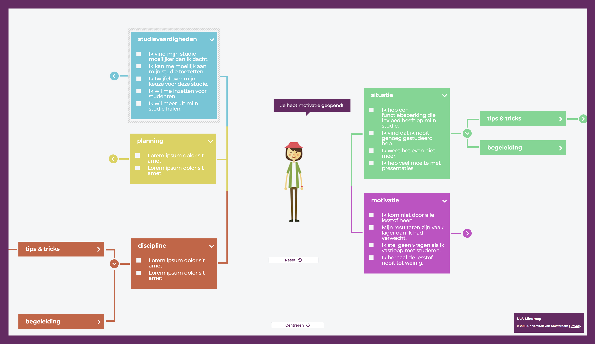
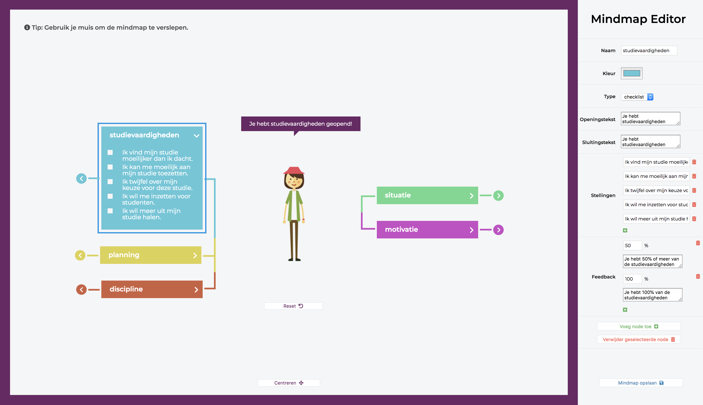

# UvA Mindmap

UvA Mindmap is an interactive way for students to find the help they need.
By organizing topics per subject in a mindmap-like webapp, they can quickly filter for the assistance they're looking for, be it an instructional video, some helpful links, some text or contact details of a study advisor.

## Key Features

- Runs completely client-side.
- Support for richtext, checklists with interactive feedback and youtube videos.
- WYSIWYG editor with built-in richtext-editor.

## Setup
The application itself is completely client-side and can be hosted on any static host.
For the editor to work, there are two requirements:

1. The editor-scripts need to be included in the `index.html` page.
2. A JSON-receiving endpoint should be available that can update the contents of the `content.json` file with the received content.

The endpoints for reading and saving of data are located at the top of `mindmap.js` and `editor.js` and can be adjusted for your own setup.

## Screenshots

### Client

### Editor

